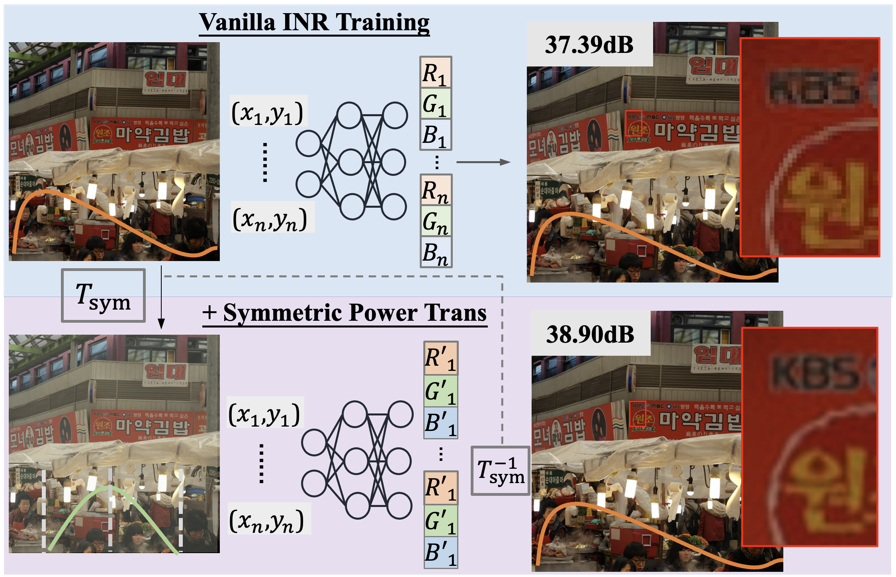
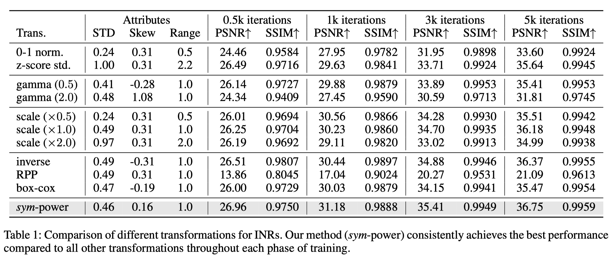

# Enhancing Implicit Neural Representations via Symmetric Power Transformation

### [Project Page](https://weixiang-zhang.github.io/proj-symtrans/) | [Paper](https://arxiv.org/abs/2412.09213) | [Code](https://github.com/zwx-open/Symmetric-Power-Transformation-INR) | [Checkpoints](https://drive.google.com/drive/folders/1VMtc84T4UsgoAluNKtOg-qoJXb1Z27q0?usp=drive_link)

[Weixiang Zhang](https://weixiang-zhang.github.io/),
[Shuzhao Xie](https://shuzhaoxie.github.io/),
Chengwei Ren,
Shijia Ge,
Mingzi Wang,
[Zhi Wang*](http://pages.mmlab.top/)<br>
Tsinghua University \
\*: Corresponding Author

This is the official PyTorch implementation of Enhancing Implicit Neural Representations via Symmetric Power Transformation" (accepted by *AAAI 2025*).

# Overview
<p align="center">
  
</p>

**Abstract.** We propose **symmetric power transformation** to enhance the capacity of Implicit Neural Representation (INR) from the perspective of data transformation. Unlike prior work utilizing random permutation or index rearrangement, our method features a reversible operation that does not require additional storage consumption. Specifically, we first investigate the characteristics of data that can benefit the training of INR, proposing the Range-Defined Symmetric Hypothesis, which posits that specific range and symmetry can improve the expressive ability of INR. Based on this hypothesis, we propose a nonlinear symmetric power transformation to achieve both range-defined and symmetric properties simultaneously. We use the power coefficient to redistribute data to approximate symmetry within the target range. To improve the robustness of the transformation, we further design deviation-aware calibration and adaptive soft boundary to address issues of extreme deviation boosting and continuity breaking. Extensive
experiments are conducted to verify the performance of the proposed method, demonstrating that our transformation can reliably improve INR compared with other data transformations. We also conduct 1D audio, 2D image and 3D video fitting tasks to demonstrate the effectiveness and applicability of our method.


# Quick Start
## Clone Repository
```shell
git clone https://github.com/zwx-open/Symmetric-Power-Transformation-INR.git
cd Symmetric-Power-Transformation-INR
```
## Enviroment Setup
todo;

> **Tested Enviroments**: 
</br> - Ubuntu 20.04 with PyTorch 1.12.1 & CUDA 11.3.1 on RTX 3090

## Run Demo
> Demo: Fit `DIV2K/test/00.png` with SIREN + Sym-power-trans (5k epochs; ~5minutes)
```shell
python run.py 
```


# High Level Structure
```
├── assets
│   └── intro.png
├── components
│   ├── lpips.py
│   ├── ssim.py
│   ├── ssim_.py
│   └── transform.py ## The implementaion of Symm-Power-Trans
├── config.py ## The config of different experimental settings 
├── data
│   ├── div2k
│   ├── Kodak
│   ├── libri_test_clean_121726
│   └── text
├── main.py
├── manager.py ## Manage arguments under different experimental settings
├── models.py ## Backbones of INR
├── opt.py  ## Arugment parser
├── README.md
├── run.py ## Run this file
├── trainer
│   ├── base_trainer.py
│   ├── img_trainer.py  
└── util
    ├── io.py
    ├── logger.py
    ├── misc.py
    ├── recorder.py
    └── tensorboard.py
```

# Code Execution
## How to run experiments in this repo? 
Please update code in `run.py` (~line 62) to run different experiments:
The defualt is running demo (exp_000):
```py
if __name__ == "__main__":

    exp = "000"
    param_sets = PAMRAM_SET[exp]
    gpu_list = [i for i in range(len(param_sets))]
    
    run_tasks(exp, param_sets, gpu_list)
```
For example, if you want to run experment 001, you can update it with `exp = "001"`. Moreover, feel free to allocate tasks for different gpu:
```py
if __name__ == "__main__":

    exp = "001"
    param_sets = PAMRAM_SET[exp]
    gpu_list = [3, 0] # assert len(param_sets) == len(gpu_list)
    
    run_tasks(exp, param_sets, gpu_list)
```
## How to set different tasks \& paramters?
For example, if you want to run *sym_power* and *01_norm* in `exp_001`, please update `config.py` with:

```python
PAMRAM_SET["001"] = (
            "01_norm",
            # "z_score",

            #"gamma_0.5",
            #"gamma_2.0",

            # "scale_0.5",
            # "scale_1.0",
            # "scale_2.0",

            # "inverse",
            # "rpp"
            # "box_cox",
            
            "sym_power",          
        )
```
## How to register new task?
Feel free to register new experiment by adding new key in `config.py`:
```python
PAMRAM_SET["999"] = (
            "xxx1",
            "xxx2",        
        )
```
and define corresponding function in `manager.py`:
```python
def _set_exp_999(self, param_set):
    if param_set == "xxx1":
        self.p.xxx = xxx1
    elif param_set == "xxx2":
        self.p.xxx = xxx2
```

## More Flexible Way
If you prefer a more flexible way to run this code, please refer to `debug.py`:
```py
'''flexiblely set all arugments in opt.py'''
def debug(use_cuda=0):
    args = [
        "--model_type",
        "siren",
        "--input_path",
        "./data/div2k/test_data/00.png",
        "--eval_lpips",
        "--transform",
        "sym_power",
        "--tag",
        "debug_demo",
        "--lr",
        "0.0001",
        "--up_folder_name",
        "000_demo", 
    ]
    os.environ["CUDA_VISIBLE_DEVICES"] = str(use_cuda) 
    script = "python main.py " + " ".join(args)
    print(f"Running: {script}")
    os.system(script)
```

Then running `debug.py`:
```python
python debug.py
```

# Reproducing Results from the Paper

## Comparison of Different Transformations (Table 1)
<p align="center">
  
</p>

The setting of this experiments is correspoinding to `_set_exp_001()` in `manager.py`. Please run `exp_001` following [How to run experiments in this repo](#How-to-run-experiments-in-this-repo?).

Chekckpoints can be found in [here](https://drive.google.com/drive/folders/1VMtc84T4UsgoAluNKtOg-qoJXb1Z27q0?usp=drive_link) (`log/001_trans`).


# Citation
Please consider leaving a ⭐ and citing our paper if you find this project helpful:

```
@article{sym-power-trans-inr,
  title={Enhancing Implicit Neural Representations via Symmetric Power Transformation},
  author={Zhang, Weixiang and Xie, Shuzhao and Ren, Chengwei and Ge, Shijia and Wang, Mingzi and Wang, Zhi},
  journal={arXiv preprint arXiv:2412.09213},
  year={2024}
}
```
